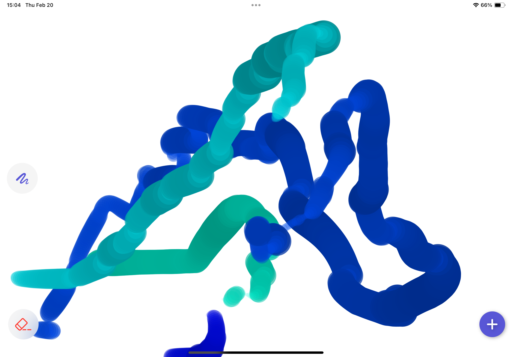
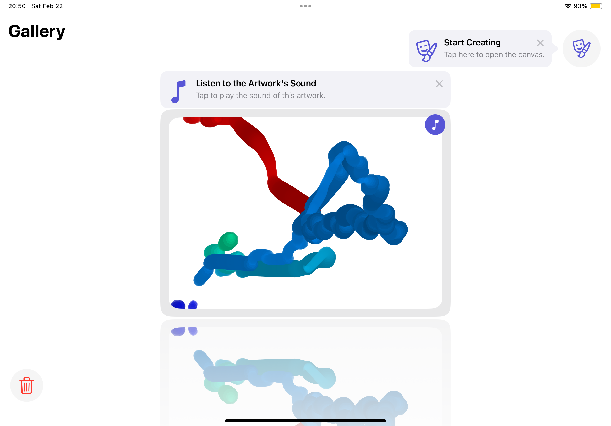
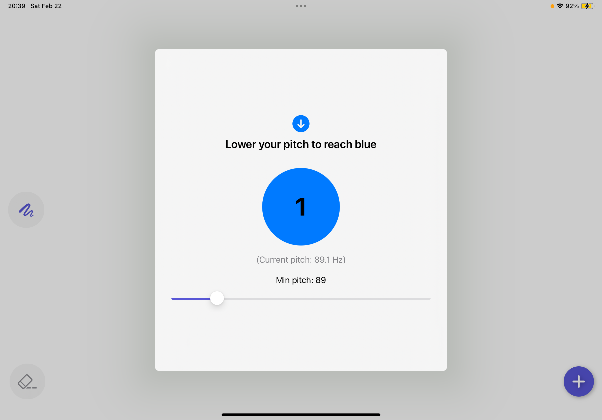

# EchoArt - 声で描くアート 🎨 🎵

> *「あなたが「あー」と発声すると、声がペンとなって芸術が生まれる」*

EchoArtは、声を用いてデジタルアートを創造するiOSアプリケーションです。リアルタイムで声のピッチ、音量、持続時間を分析し、声だけで美しく動的な絵を描くことを可能にします。

[](https://swift.org/)
[](https://developer.apple.com/xcode/swiftui/)
[](https://developer.apple.com/swift-student-challenge/)

[English](README.md) | 日本語

## 📱 アプリの概要

EchoArtはリアルタイムで声を分析し、以下の特徴を活かして視覚的なアートに変換します：

- **声からアートへの変換**: 声がデジタル絵筆となり、音を通して芸術を生み出します
- **ピッチによる色のコントロール**: 高いピッチは暖色系（赤）、低いピッチは寒色系（青）を作り出します
- **音量による太さのコントロール**: 大きな音は太い線を、小さな音は細い線を生み出します
- **持続音による動き**: 描画の方向と流れは、連続的な発声によってコントロールされます
- **音声録音**: アートワークと、それを作り出した声の両方を保存できます
- **ダイナミックなギャラリー**: 作品を閲覧し、各作品を形作った音声を再生できます
- **パーソナライズされた声のキャリブレーション**: アプリをあなたの声の範囲と環境に合わせてカスタマイズできます

## 🚀 特徴とスクリーンショット

### 声描画キャンバス

声がリアルタイムで視覚的アートに変換されるメインキャンバス。

### ダイナミックギャラリー

没入感のある3Dカルーセルインターフェースで作成されたアートワークを閲覧。

### 声のパーソナライゼーション

アプリをあなた独自の声の特性と環境に合わせてカスタマイズ。

## 🧩 アーキテクチャと技術詳細

EchoArtは、MVVM（Model-View-ViewModel）アーキテクチャパターンを採用しています：

### アプリケーション構造

```
EchoArt/
├── Models/                  # データモデルとコア機能
│   ├── Artwork.swift        # アートワーク保存用のSwiftDataモデル
│   └── AudioManager.swift   # コアオーディオ処理と視覚化
├── ViewModels/              # ビジネスロジック
│   ├── CanvasViewModel.swift     # キャンバスレンダリングロジック
│   ├── GalleryViewModel.swift    # ギャラリー管理
│   └── PersonalizationViewModel.swift  # 声のキャリブレーション
├── Views/                   # UIコンポーネント
│   ├── CanvasView.swift     # 描画インターフェース
│   ├── GalleryView.swift    # アートワークコレクション
│   ├── PersonalizationView.swift  # 声のキャリブレーションUI
│   └── Tips/                # ユーザーガイダンスコンポーネント
├── Utilities/               # ヘルパーコンポーネント
│   ├── CoverFlow.swift      # 3Dカルーセル表示コンポーネント
│   └── FloatingButton.swift # カスタムフローティングアクションボタン
└── MyApp.swift              # アプリのエントリーポイント
```

### 主要技術

- **SwiftUI**: 直感的で応答性の高いインターフェースのためのモダンな宣言型UIフレームワーク
- **SwiftData**: アートワーク保存のための永続化フレームワーク
- **AVFoundation**: リアルタイムの音声キャプチャと処理
- **Accelerate Framework**: 音声周波数分析のための高速フーリエ変換（FFT）
- **TipKit**: ユーザーガイダンスとオンボーディング体験

EchoArtは、音声入力をリアルタイムで視覚的アートに変換する高度な信号処理パイプラインを採用しています：

```
┌─────────────────┐    ┌─────────────────┐    ┌─────────────────┐
│  音声キャプチャ　　│    │ 信号解析 　　　　　│    │ 視覚マッピング　　 │
│                 │───▶│                 │───▶│                 │
│ - AVFoundation  │    │ - FFT処理 　　　　│    │ - ピッチを色へ    │
│ - バッファサイズ  │  　 │ - ハンウィンドウ  │    │ - 音量を         │
│   1024サンプル　　│    │ - ピーク検出　    │    │   太さとX位置へ   │
└─────────────────┘    └─────────────────┘    └─────────────────┘
                                                       │
                                                       ▼
┌─────────────────┐    ┌─────────────────┐    ┌─────────────────┐
│  永続化          │    │  レンダリング     │    │ 動きのロジック 　　│
│                 │◀───│                 │◀───│                 │
│ - SwiftData     │    │ - Core Graphics │    │ - ラインセグメント │
│ - 音声ストレージ  │　　 │ - UIKit Canvas  │    │  - 補間   　　　　│
└─────────────────┘    └─────────────────┘    └─────────────────┘
```

### コア技術実装

1. **リアルタイム音声解析**:
   - AVFoundationを通じて音声入力をキャプチャ
   - FFT分析により支配的な周波数を抽出
   - RMS（二乗平均平方根）計算による音量レベルの算出

2. **高速フーリエ変換（FFT）実装**:

   **FFT設計判断**:
   - **バッファサイズ選択（1024サンプル）**: 周波数解像度と時間応答性のバランスを考慮して選択。より大きなバッファ（例：2048）はより良い周波数解像度を提供しますが、より多くの遅延を導入し、より小さなバッファ（例：512）はより応答性が良いですが、低周波には精度が劣ります。
   
   - **ハンウィンドウの適用**: スペクトル漏れを減少させるために入力サンプルに適用。ハンウィンドウ関数は各分析フレームのエッジで信号を滑らかにテーパー化し、連続オーディオの不連続セグメントを分析する際に生じる可能性のあるアーティファクトを減少させます。
   
   - **周波数計算**: FFTビンインデックスと周波数の関係は標準的なFFT公式に従い、周波数はビンインデックスにサンプリングレートを掛け、FFTサイズで割ったものです。
   
   - **メモリ管理**: リアルタイム処理中の最適なパフォーマンスを確保し、不要なメモリコピーを避けるためにSwiftのポインタベースのAPIを使用。

   [FFT実装方程式](Resourses/jp/equations-fft-jp.md)

4. **音声-視覚マッピング**:

   **マッピング設計考慮事項**:
   
   - **対数的ピッチマッピング**: 人間のピッチ知覚は線形ではなく対数スケールに従います。周波数の2倍（例：220Hzから440Hz）は1オクターブの増加として知覚されます。対数マッピングを使用することで、人間の声の範囲（通常80Hz-1100Hz）全体で知覚的に均一な色分布を作成します。
   
   - **色スペクトル選択**: HSVカラーモデルを使用し、色相値が0.0（赤）から0.66（青）の範囲で、それぞれ高いピッチと低いピッチに対応します。このマッピングは自然な関連付け（高=暖かい、低=涼しい）に従い、明確な視覚的フィードバックを提供します。
   
   - **ダイナミックレンジ圧縮**: 声の音量（デシベル単位）を使用可能な視覚的範囲に圧縮し、静かな声と大きな声の両方が意味のある視覚的出力を作成できるようにし、異なる声の強さを持つユーザーにアプリをアクセシブルにします。
   
   - **位置マッピング**: キャンバス上のY位置はピッチによって決定され、X位置は音量の影響を受け、ユーザーが声と結果として生じる視覚効果の関係を直感的に理解できる自然な2D表現空間を作成します。

   [音声-視覚マッピング方程式](Resourses/jp/equations-mapping-jp.md)

6. **音声-視覚同期**:

   **同期実装戦略**:
   
   - **セグメント録音アプローチ**: 音声はアクティブな描画期間に合わせてセグメントで録音され、連続録音よりもメモリ効率が良くなります
   
   - **コンポジションベースの結合**: AVMutableCompositionを使用して、可聴ギャップやクリックなしでオーディオセグメントをシームレスに結合します
   
   - **並行処理**: Swift concurrency（async/await）を活用してノンブロッキングオーディオ処理を実現
   
   - **ストレージ最適化**: オーディオデータはAAC エンコーディング（AVAssetExportPresetAppleM4Aを介して）を使用したM4A形式で保存され、品質とファイルサイズのバランスを取ります
   
   - **SwiftData統合**: 結合されたオーディオデータはベクトル描画データとともに統一されたSwiftDataモデルに保存され、アートワークとオーディオがアプリのライフサイクル全体を通じてペアで保持されることを保証します

   [音声同期図](Resourses/jp/audio-sync-diagram-jp.md)

3. **パーソナライゼーションシステム**:

   **パーソナライゼーション設計根拠**:
   
   - **環境ノイズキャリブレーション**: ユーザーの環境を5秒間のウィンドウで測定してノイズフロアを決定します。これは異なる録音環境（静かな部屋、騒がしい空間）が効果的な音声検出のために異なる閾値を必要とするため、重要です。
   
   - **適応型閾値設定**: アクティブな音声閾値を環境ノイズにキャリブレートされたオフセットを加えて動的に設定します。このアプローチにより、アプリは異なる環境全体でバックグラウンドノイズと意図的な発声を区別できます。
   
   - **ボーカルレンジマッピング**: 
     - ピッチ範囲キャリブレーションは、ユーザーが生成できる最も高いピッチと最も低いピッチの両方を測定します
     - 音量キャリブレーションは、快適な最大音量を決定します
     - このパーソナライゼーションにより、さまざまな声の特性（例：子供、大人、ソプラノ、バス声）を持つユーザーにアプリをアクセシブルにします
   
   - **ユーザーガイド付きキャリブレーションプロセス**: 視覚的フィードバックを伴うインタラクティブなステップバイステッププロセスは、精度とユーザーエンゲージメントの両方を提供します
   
   - **永続性**: キャリブレーション値はUserDefaultsに保存され、アプリが各ユーザーの声のプロファイルをセッション間で記憶できるようにします

   [パーソナライゼーションアルゴリズム](Resourses/jp/equations-personalization-jp.md)

## 💡 インスピレーションと目的

EchoArtは、日本語の「声色」（こわいろ）という言葉からインスピレーションを得ました。これは「声」（こえ）と「色」（いろ）を組み合わせて、声のトーンを表現する言葉です。この概念と、開発者自身の多汗症（手の過度の発汗を引き起こす状態）の経験が、従来の道具を使わずに芸術表現を可能にするツールの創造につながりました。

このアプリは包括的にデザインされており、従来の描画が難しい可能性のある身体的制限を持つ人々のための代替的な創造的媒体を提供しています。また、発話の違いを持つ人々が自分の声を鮮やかな色で視覚化する独自の方法を作り出し、潜在的に自信と新しい形の自己表現を育むことができます。

## 🧑‍💻 開発と貢献

EchoArtはSwift Student Challenge 2025のエントリーとして開発されました。（結果待ち中）このアプリは、iOSアプリケーションにおける音声処理、視覚的レンダリング、およびパーソナライズされたユーザーエクスペリエンスの統合を示しています。

## 📫 連絡先

お問い合わせやフィードバックはこちらまで：
- Email: [ hiromureve1522@icloud.com](mailto:hiromureve1522@icloud.com)
- GitHub: [@HIROMU522](https://github.com/HIROMU522)
- LinkedIn: [Hiromu Tanaka](https://www.linkedin.com/in/hiromu-tanaka-15958b2a6/)
